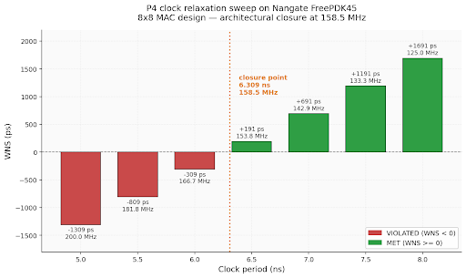

# P4 — Timing Closure Case Study: 8×8 MAC on Nangate FreePDK45 45 nm

**A methodology-driven timing closure investigation on a datapath the library cannot implement efficiently. Quantifies the library selection tradeoff and identifies architectural closure at 158.5 MHz on Nangate FreePDK45.**



---

## Headline Finding

**Maximum achievable clock frequency for this design on Nangate FreePDK45 without RTL modification: 158.5 MHz.**

The target of 200 MHz is 26 % above the architectural limit imposed by this library. The same RTL closes cleanly at 200 MHz on GSCLIB045 (see [P3b](https://github.com/Lomne22339/P3b-cadence-45nm-MAC)) — the delta is purely due to library cell composition.

## Design Under Test

- **Design:** 8×8 Multiply-Accumulate unit (`simple_mac`)
- **Composition:** FSM controller + 4-entry coefficient register file + 16-bit accumulator, ~140 lines Verilog
- **Netlist size:** 1180 std-cell instances, 86 combinational + 20 sequential (Tempus view)
- **Same RTL** as P3a (Synopsys, 65 nm) and P3b (Cadence, 45 nm GSCLIB045) — enables direct cross-library comparison

## Baseline Timing State

Captured via Cadence Tempus 20.10 on the Genus-synthesized (effort medium) Nangate netlist at 200 MHz (5.0 ns period):

| Metric | Value |
|---|---|
| WNS | **−1309 ps** |
| TNS | **−23,572 ps** |
| Violating paths | **40** |
| Setup requirement | 1020 ps |
| Clock uncertainty | 200 ps |
| Hold violations | 0 |

**Path-group breakdown:**

| Group | WNS | TNS | # Violators |
|---|---|---|---|
| IN2REG | −1309 ps | −11,574 ps | 12 |
| REG2REG | −1215 ps | −11,998 ps | 28 |
| IN2OUT / REG2OUT | 0 | 0 | 0 |

## Critical Path Analysis

**Path:** `coef_sel[1]` (primary input) → 31 combinational gates through `mul_58_40/*` (8×8 array multiplier) → `mult_result_reg[14]/SI` (SDFFR_X2 flip-flop scan input)

**Cell composition:** 27× NAND2_X1 (minimum drive), 4× INV_X1/X2/X4/X8, 1× AND2_X2, 1× BUF_X16, 1× OAI21_X1

**Why so long:** Nangate FreePDK45 ships **no dedicated adder cells**. The multiplier's carry chain is built entirely from primitive NAND2/INV gates, producing a 31-gate deep combinational path. GSCLIB045's `ADDFHX*` full-adder family collapses each 1-bit adder into a single cell — the same design synthesizes with a ~20-gate carry chain.

The arrival time at the endpoint is **5089 ps** — 89 ps *over* the 5000 ps clock period before setup timing is even applied.

---

## Iteration 1 — Genus High-Effort Re-synthesis

**Hypothesis:** Bumping Genus effort from medium to high across all stages, plus enabling `tns_opto` and `retime`, should recover 100–300 ps by better cell selection and drive-strength matching.

**Method:** re-synthesized with `syn_generic_effort=high`, `syn_map_effort=high`, `syn_opt_effort=high`, `tns_opto=true`, `retime=true`.

**Result:** **null lever.**

- Genus internal STA reported WNS −1189 ps (claimed 120 ps improvement)
- Tempus signoff reported WNS −1309 ps (unchanged)
- `diff` of the two mapped netlists shows they are **bit-for-bit identical** except for the timestamp comment
- Retiming did not fire — the multiplier is monolithic combinational logic with no intermediate flip-flops for Genus to redistribute

**Conclusion of iter 1:** Genus effort knobs alone cannot move signoff timing on this library-bound datapath.

---

## Iteration 2 — Clock Relaxation Sweep

**Hypothesis:** If effort knobs cannot compress the combinational path, sweep the clock period to identify the actual architectural limit.

**Method:** Tempus swept clock period from 5.0 to 8.0 ns in 0.5 ns steps on the iter 1 netlist.

**Result:**

| Period (ns) | Frequency (MHz) | WNS (ps) | TNS (ps) | Violators | Status |
|---|---|---|---|---|---|
| 5.0 | 200.0 | −1309 | −23,572 | 40 | VIOLATED |
| 5.5 | 181.8 | −809 | −10,876 | 19 | VIOLATED |
| 6.0 | 166.7 | −309 | −2,478 | 14 | VIOLATED |
| **6.5** | **153.8** | **+191** | **0** | **0** | **MET** ✅ |
| 7.0 | 142.9 | +691 | 0 | 0 | MET |
| 7.5 | 133.3 | +1191 | 0 | 0 | MET |
| 8.0 | 125.0 | +1691 | 0 | 0 | MET |

**Closure knee is between 6.0 and 6.5 ns.** Since arrival time is invariant at 5089 ps (no parasitic variation across sweeps), the exact closure period is:

```
T_closure = arrival + setup + uncertainty
          = 5089 + 1020 + 200
          = 6309 ps → 158.5 MHz
```

**Conclusion of iter 2:** the design has a hard architectural limit of **158.5 MHz** on Nangate FreePDK45 with the current netlist.

---

## Cross-Library Comparison

| Aspect | GSCLIB045 (P3b) | Nangate FreePDK45 (P4) |
|---|---|---|
| Combinational cells | 324 | 84 |
| Sequential cells | 126 | 20 |
| Dedicated adder cells | ✅ (ADDFHX family) | ❌ |
| Clock cell family | CLKBUFXn / CLKINVXn | Generic BUF/INV |
| Multi-Vt support | Single Vt shipped | Single Vt shipped |
| Metal layers | 9 | 4 |
| **Max frequency at same RTL** | **200+ MHz** | **158.5 MHz** |
| **Frequency delta** | **— (baseline)** | **−20.75 %** |

Library selection accounts for a ~21 % frequency reduction on this datapath — a lesson in why library cell diversity is a first-class design decision, not a downstream detail.

---

## Optimization Levers Evaluated

| Lever | Attempted | Result | Reason |
|---|---|---|---|
| Genus effort=medium | Yes (baseline) | −1309 ps | starting point |
| Genus effort=high | Iter 1 | −1309 ps (no change) | Identical netlist produced |
| Retiming (Genus) | Iter 1 | Not applicable | No intermediate registers to move in monolithic multiplier |
| Multi-Vt swap | Investigated | Unavailable | Nangate ships single Vt only |
| Clock relaxation | Iter 2 | Closes at 158.5 MHz | Legitimate library-limit result |
| Innovus optDesign | Not attempted | Estimated 2–5 % headroom | Cell sizing with placement awareness — would refine, not change conclusion |
| RTL pipelining | Not attempted | Would close at 200 MHz | Adds 1 cycle latency; the only path to 200 MHz on this library |

---

## Engineering Conclusion

Three findings from three iterations:

1. **Genus tool-only optimization is a null lever on library-constrained datapaths.** The tool's effort knobs cannot manufacture cell diversity the library does not provide.
2. **The design has a well-defined architectural closure point on Nangate FreePDK45: 158.5 MHz.** Trying to close above this without RTL changes is a losing game.
3. **Library selection can account for 20+ % of achievable frequency on arithmetic-heavy datapaths.** For designs whose critical path is a multiplier, adder chain, or comparator, the library choice matters more than tool effort.

The engineering-appropriate response to "close this design at 200 MHz on Nangate" is not "try harder with the tool" — it is either **specify a slower clock (158 MHz)**, **change the library**, or **change the RTL (add a pipeline stage in the multiplier)**. The tool cannot bridge an architectural gap.

---

## Directory Layout

```
P4_timing_closure_45nm/
├── README.md               ← this file
├── rtl/
│   └── simple_mac.v         # design RTL, unchanged from P3a/P3b
├── constraints/
│   └── simple_mac_nangate.sdc
├── scripts/
│   ├── genus_iter1.tcl               # high-effort re-synthesis
│   ├── tempus_baseline.tcl           # baseline STA
│   ├── tempus_iter1.tcl              # iter 1 verification STA
│   └── tempus_clock_sweep.tcl        # iter 2 clock relaxation sweep
├── syn_report/                       # Genus mapped netlists (baseline + iter1)
├── sta_report/                       # Tempus reports at every stage
└── docs/
    ├── baseline.md                   # baseline capture details
    ├── iter1_result.md               # Genus high-effort attempt
    └── iter2_result.md               # clock sweep + closure point
```

## Tools & Versions

| Tool | Version |
|---|---|
| Cadence Genus | 19.13-s073_1 |
| Cadence Tempus | 20.10-p003_1 |
| Library | Nangate FreePDK45 v1.0 (typical corner) |

**Environment:** RHEL 7.9, IIIT Delhi EDA server, VNC session, tcsh + Cadence CAD environment.

---

## Related Projects

- **[P3b — RTL-to-GDSII on GSCLIB045 45 nm](https://github.com/Lomne22339/P3b-cadence-45nm-MAC)** — same MAC design, different library, closed at 200 MHz with WNS +45 ps post-route
- **P3a — Synopsys DC 65 nm** *(https://github.com/Lomne22339/P3a-synopsys-dc-65nm)* — same RTL, Synopsys toolchain, cross-vendor comparison

---

## Author

**Noorain Ansari** — B.Tech ECE, IIIT Delhi
Aspiring VLSI Physical Design Engineer
[LinkedIn](https://www.linkedin.com/in/noorain-ansari) · [GitHub](https://github.com/Lomne22339)
